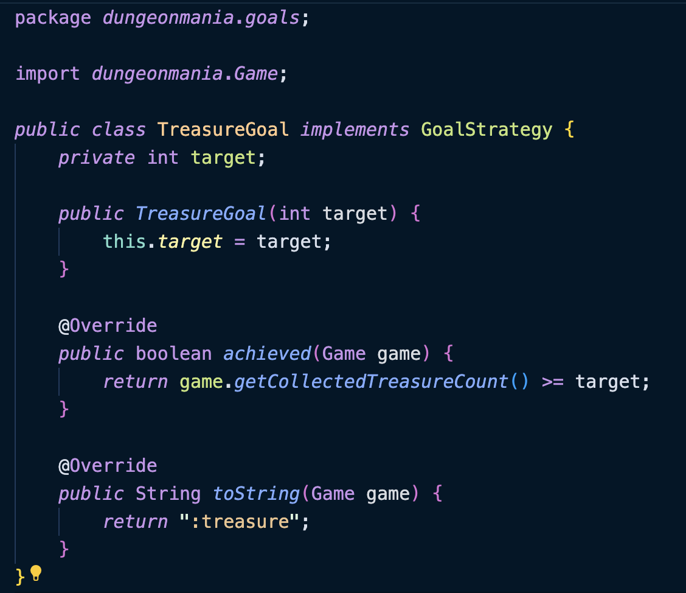

# Assignment II Pair Blog Template

## Task 1) Code Analysis and Refactoring ⛏️

### a) From DRY to Design Patterns

[Links to your merge requests]
(https://nw-syd-gitlab.cseunsw.tech/COMP2511/24T1/teams/M17A_FLINT/assignment-ii/-/merge_requests/3/put/links/

> i. Look inside src/main/java/dungeonmania/entities/enemies. Where can you notice an instance of repeated code? Note down the particular offending lines/methods/fields.

ZombieToast.java (L26-53) and Mercenary.java (L102-129)
Both classes use the same move method if the player has an Invincibility Potion or Invincibility Potion. 

> ii. What Design Pattern could be used to improve the quality of the code and avoid repetition? Justify your choice by relating the scenario to the key characteristics of your chosen Design Pattern.

- Implement a strategy pattern for the move method by creating an interface to represent MovementStrategy with a method for determining the next position.
- Create a set of different movement behaviours with the interface used by enemies such as RandomMove, AlliedMove etc.
- This is the best design choice as the movement behaviour becomes encapsulated into separate strategy classes which removes repetition while also allowing for extension by easily adding new movement behaviours in future without modifying the existing code.

Strategy Pattern Characteristics
- Allows us to choose between different movement behaviour algorithms at runtime
- Replaces the bulky conditional statement repeated in each of the enemy classes which determines movement behaviour, and instead extracts them all into individual classes implementing the same interface

> iii. Using your chosen Design Pattern, refactor the code to remove the repetition.

We began by creating a MovementStrategy interface, which defines a move method. For each movement strategy employed by Mercenary and ZombieToast, such as AlliedMovement, ApproachPlayer, FollowHostile, and Random, we developed separate classes that implemented this interface. The logic for each movement behavior was then encapsulated within the appropriate strategy class, with each strategy returning the new position to which the enemy should move. 

We then introduced a movement variable into the Enemy abstract class, along with its corresponding getters and setters. Within the move method of Mercenary and ZombieToast, we implemented a calculateMovement method. This method determines the appropriate movement strategy by taking the map as a parameter. Based on certain conditions, the method sets movement to the appropriate strategy by calling setMovementStrategy. Finally, the move method proceeds to move the enemy by determining the next position through a call to movement.move.

### b) Observer Pattern

> Identify one place where the Observer Pattern is present in the codebase, and outline how the implementation relates to the key characteristics of the Observer Pattern.

The Observer pattern is present in the Switch and the Bomb classes. When a boulder is pushed onto a switch, the Switch class streams through a list of bombs it is holding that are cardinally adjacent to the switch. For each bomb, it calls the bomb’s notify function, which makes the bomb explode.
Observer Pattern Characteristics:
- The ‘subject’ is the switch.
- The ‘observers’ are the list of bombs the switch class holds.
- The switch notifies all the bombs when its state changes.
- The switch only notifies the bombs; it doesn’t know what the bombs will do as a result or how.
- The implementation for what the bombs will do upon notification is confined to the Bomb class.

### c) Inheritance Design

[Links to your merge requests]
(https://nw-syd-gitlab.cseunsw.tech/COMP2511/24T1/teams/M17A_FLINT/assignment-ii/-/merge_requests/4)

> i. Name the code smell present in the above code. Identify all subclasses of Entity which have similar code smells that point towards the same root cause.

Exit extends the abstract class Entity but does not implement any logic into many of the abstract methods such as onOverlap, onMovedAway and onDestroy. This code smell is also present in other classes such as Portal, Wall, Switch, Player, Door, Boulder etc. The code currently does not override the methods from its abstract class and therefore should not have been included in the first place as it makes the code difficult to understand. 

This poor design is also present in buildables where subclasses use the same logic for many of their methods. To fix this, we added this logic into its abstract class and removed the override method from the relevant subclasses. 

Collectables extend entity and implement the same logic for the methods onOverlap and canMoveTo which is a code smell because there is repeated code throughout these classes. To improve the design, we created an abstract class Collectables which extends Entity and moved the methods here instead. 

Similarly, playerState was refactored such that the state transitions methods are implemented into the abstract class instead of repeatedly throughout the individual states. 

> ii. Redesign the inheritance structure to solve the problem, in doing so remove the smells.
See above in part i

### d) More Code Smells

[Links to your merge requests]

> i. What design smell is present in the above description?

The code is too rigid/inflexible because of tight coupling. It is most likely that some classes rely on the internal workings of other classes or some classes having their own code that could be abstracted to an interface or superclass.

> ii. Refactor the code to resolve the smell and underlying problem causing it.

The underlying problem is that the onOverlap function for all Entities is attempting to do too much. Since there are multiple entities that aren’t collected as well as collected on Overlap, there is a lot of reused code due to overriding the function for each class.
To solve this, we will create a Collectables abstract class that the collectible entities inherit. This abstract class contains the onOverlap and canMoveOnto override.

### e) Open-Closed Goals

[Links to your merge requests]
(https://nw-syd-gitlab.cseunsw.tech/COMP2511/24T1/teams/M17A_FLINT/assignment-ii/-/merge_requests/5)

> i. Do you think the design is of good quality here? Do you think it complies with the open-closed principle? Do you think the design should be changed?
The design clearly does not comply with the open closed principle which is obvious by the extensive use of switch statements in the methods. There is repeated code in the achieved and toString methods which violates the DRY principle and OCP since the entity can not be extended without modifying the existing code. We can see that if we wanted to add a new goal type, it wouod require us modifying both the achieved and toString methods. This design makes the code difficult to understand, maintain and modify and therefore should be changed.

> ii. If you think the design is sufficient as it is, justify your decision. If you think the answer is no, pick a suitable Design Pattern that would improve the quality of the code and refactor the code accordingly.

- In order to fix this design issue, I implemented a strategy pattern. I created a goal strategy interface and created different goal type classes which implemented the achieved and toString methods. 

- I declared a goalStrategy variable in goal and used a switch statement to pick the strategy the goal instance. Previously, each goal was hardcoded into the goal class which violates OCP, however after refactoring using the strategy pattern, it instead chooses the strategy at runtime to determine which implementation to use making for more organised and readable code. 

### f) Open Refactoring

[Merge Request 1](https://nw-syd-gitlab.cseunsw.tech/COMP2511/24T1/teams/M17A_FLINT/assignment-ii/-/merge_requests/8)

Refactoring the State Pattern in Potions:

Currently there are two unnecessary fields in PlayerState: isInvisible and isInvincible booleans. Since a player can only have a maximum of one state active at a time, we will replace these fields with a single String field called state.

In the Player class, there are if statements that transition the player’s state based on the potion in the queue. Player should not be responsible for the specific workings of how the player state changes. Thus, we will abstract this code to PlayerState. Player will simply call one transition() function and PlayerState will adjust the state accordingly.

We will remove the multiple different transition functions for each state and turn them into if statements in one transition function.

[Merge Request 2](https://nw-syd-gitlab.cseunsw.tech/COMP2511/24T1/teams/M17A_FLINT/assignment-ii/-/merge_requests/9/diffs)

- Refactored long else if chain into a switch statement.

Add all other changes you made in the same format here:

## Task 2) Evolution of Requirements 👽

### a) Microevolution - Enemy Goal

[Links to your merge requests](https://nw-syd-gitlab.cseunsw.tech/COMP2511/24T1/teams/M17A_FLINT/assignment-ii/-/merge_requests/11)

**Assumptions**

Assuming that to destroy a zombie toast spawner, the interaction doesn't reduce the durability of the sword.

**Design**

- I created and EnemiesGoal class that implements GoalStrategy. This class holds the target amount of enemies that need to defeated. It
 also has an override function that checks if the goal has been achieved each tick.

- In game, after an enemy is defeated and has their health reduced to zero, a count of defeated enemies held by the player is incremented by one.

- In ZombieToastSpawner, if the player interacts with it while adjacent to it and holding a sword, the spawner is destroyed.

**Changes after review**

[Design review/Changes made]

**Test list**

EnemiesGoalsTest
- defeatOneSpider
- defeatTwoZombieToastSpawners

**Other notes**

[Any other notes]

### Choice 1 Sun Stone & More Buildables

[Links to your merge requests]
(
https://nw-syd-gitlab.cseunsw.tech/COMP2511/24T1/teams/M17A_FLINT/assignment-ii/-/merge_requests/6

https://nw-syd-gitlab.cseunsw.tech/COMP2511/24T1/teams/M17A_FLINT/assignment-ii/-/merge_requests/7
)

**Assumptions**
Durability for Sceptre & Midnight Armour is infinite once built
A key has priority over sunstone when player opens doors

**Design**

- I created a new class sunstone which extends Collectables, implements InventoryItem, and is a subclass of Treasure since it can be treated as a treasure in crafting. The open door functionality is added in the Door class and is not removed from the inventory list after being used. Its use in crafting functionality is added in the inventory class checkBuildCriteria and getBuildables.

- Sceptre and Midnight armour can only exist if they are built by player hence i created them as subclasses of buildables. The abstract class made it easy to define independent variables for each of the subclasses such as mindcontrol duraction etc. The functionalitiy for building sceptre and midnight armour is added in the inventory class checkBuildCriteria and getBuildables.
- For the bribing action, I changed the bribe method such that the player is checked for a sceptre first which will then perform a mindcontrol, therefore the mercenary could still be “bribed” without having treasure on the player.

Current Thoughts: 
- Currently there is significant repetition in the inventory class methods: getBuildable and checkBuildCriteria which does not adhere to the OCP since if new buildables were created then, the inventory class needs to be modified each time

- This code smell could to be refactored later on into perhaps a strategy pattern to remove repetition and improve code design
Or we coudl create a new class entirely to handle the logic separately.

**Changes after review**

[Design review/Changes made]

**Test list**
BuildablesTest: 
- buildShieldWithSunStone
- buildShieldWithSunStoneWithExistsTreasure
- buildingSceptre
- buildingSceptreUnsuccessful
- usingSceptre
- buildMidnightArmour
- buildMidnightArmourUnsuccessful
- buildMidnightArmourUnsuccessfulWithZombie

DoorsSunStoneTest:
- pickUpSunStone
- useSunStoneWalkThroughOpenDoor

**Other notes**

[Any other notes]

### Choice 2 (Insert choice)

[Links to your merge requests](https://nw-syd-gitlab.cseunsw.tech/COMP2511/24T1/teams/M17A_FLINT/assignment-ii/-/merge_requests/13)

**Assumptions**

[Any assumptions made]

**Design**

- Created HydraBattleStatistics. This handles the implementation for hydra helth gain in rounds.
- Created Hydra. Stores HydraBattleStatistics, which we use instead of the regular BattleStatistics. Has same movement override as Zombie.
- Created Assassin class that inherits Bribable superclass. Assassin class handles underlying implementation for bribe chance of success.

**Changes after review**

[Design review/Changes made]

**Test list**

BattleTest:
- testRoundCalculationsHydra()

AssassinTest:
- bribeAmount()
- allyMovementStick()

**Other notes**

[Any other notes]

### Choice 3 (Insert choice) (If you have a 3rd member)

[Links to your merge requests](/put/links/here)

**Assumptions**

[Any assumptions made]

**Design**

[Design]

**Changes after review**

[Design review/Changes made]

**Test list**

[Test List]

**Other notes**

[Any other notes]

## Task 3) Investigation Task ⁉️

[Merge Request 1](/put/links/here)

[Briefly explain what you did]

[Merge Request 2](/put/links/here)

[Briefly explain what you did]

Add all other changes you made in the same format here:
